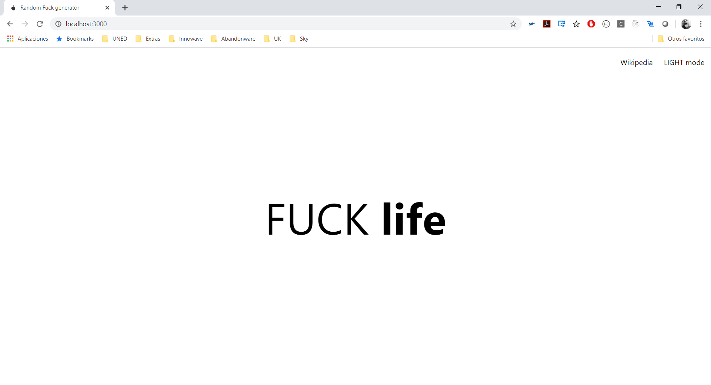

# Random F*ck in something

Random f*ck generator for creting discussion at your online world.

This "tool" will help you to start a discussion in your social network about something everyday.

## Use

It's an easy React app, so it´s simple.

- Clone it
- Open a terminal and go to the directory
- yarn start
- Wait
- Wait
- Wait
- Open a browser at http://localhost:3000 (default, everything in default)

You will see in what you can begin with.

## Future updates

This is a hobby application so don't wait until great updates... but I have the idea of:

* Use wikipedia API to take a new word
* Use a timer to change the word every... I don't know minutes/hours
* Use several word databases (if I found some) or update the json file
* Different colors, different background, different whatever
* So, light mode? xD