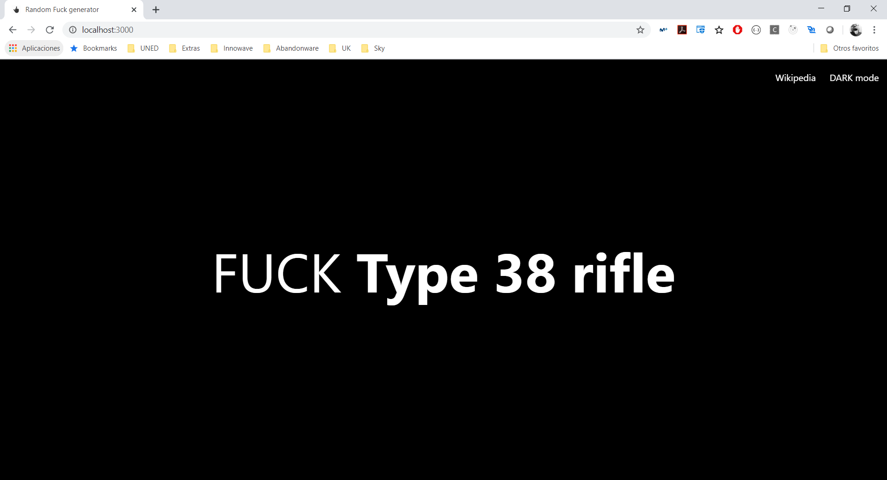

# Random F*ck in something




Random f*ck generator for creting discussion at your online world.

This "tool" will help you to start a discussion in your social network about something everyday.

## Try it

You can view and use life at http://www.randomfuck.uk/

## Use

It's an easy React app, so it´s simple.

- Clone it by using `git clone https://github.com/jhderojasUVa/randomfuckwork.git`
- `cd randomfuckwork`
- `yarn install` or `npm install`
- `yarn start` or `npm start` (whatever is best for you)
- Wait
- Wait
- Wait
- Open a browser at http://localhost:3000 (default, everything in default)

You will see in what you can begin with.

## Build time

Also, if you want to host it on your server you can do it by building it by running `npm run build` taking the build directory and coping it into your web server. The rest is all on your side!.

## Change origin

You can change the origin where the words are. From a local file at `public/storage/arraystorage.json` to a random word from the __Wikipedia__.

If you want to add new words, open the file `public/storage/arraystorage.json` and add as many (or change) as you want. The JSON file has this structure:

```json
[
    {
      "string": "life"
    }, {
      "string": "love"
    },{
      "string": "work"
    }
]
```

Where you must add a word inside an object with the property string. This way the app is prepared to have an id for a word for future online searchs (or if you want to share with someone).

For changing, click on the upper right menu to change from `internal` to `wikipedia`.

*PROBLEM*: We don't have unique id for a word so it can be repeated and the posibility of showing it at the random "doubles".

## Dark/Light theme

By default the app uses a dark theme. You can change from dark to light (it's the mode) by clicking on the upper right menu.

A small transition (for your eyes) will change the theme mode.

## Updates/Included

- Added click to show a new word
- Added wikipedia support
- Added dark/light theme support
- Added change font size depending of the letters

## Future updates

This is a hobby application so don't wait until great updates... but I have the idea of:

* Use a timer to change the word every... I don't know minutes/hours
* Use several word databases (if I found some) or update the json file
* Use the browser language for the Wikipedia
* A way to update the local storage of words
* Mobile app version? xD
* Share it with other person! (needs id or at least unique word)

## Release

- v1.0.0 released https://github.com/jhderojasUVa/randomfuckwork/tree/v1.0.0